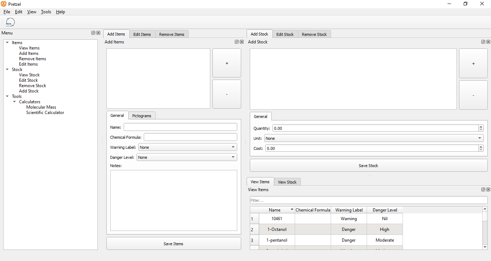

<div align="center">
<h1>This repository is now archived. You can visit the new repository at either [GitLab](https://https://gitlab.com/GetPretzel/Pretzel) or [GitHub](https://github.com/GetPretzel/Pretzel)</h1>
</div>

# Pretzel

A cross-platform, free and open source stock management system for hazardous chemicals.



## Features

- Add, edit, remove and view the items
- Add, edit, remove and view the stock
- Multiple handy calculators including a Molecular Mass and (live-calculation) scientific calculator
- Import items from Microsoft Excel (Open Document Spreadsheet and CSV coming soon)

## Downloads

Downloads are available [here](https://github.com/iwoithe/Pretzel/releases/). 

## Installing From the Source

1. Make sure [Python](https://www.python.org/downloads) is installed. Python 3.6.1+ is supported.

2. Obtain the source code by cloning this repository and extract the files.

3. Open a shell (on Windows the Command Prompt or PowerShell) in the top level directory of the extracted Pretzel source tree.

4. On Linux and MacOS, run the following command:
   
   ```bash
   pip3 install -r requirements.txt
   ```
   
   On Windows, run the following command:
   
   ```bash
   pip install -r requirements.txt
   ```

## Running

To run Pretzel:

1. Open a shell in the top level directory of Pretzel.

2. On Linux and MacOS, run the following command:
   
   ```bash
   python3 -i main.py
   ```
   
   On Windows, run the following command:
   
   ```bash
   python -i main.py
   ```

### Another Method of Running Pretzel on Windows

1. Navigate to the top level directory of Pretzel.

2. Double click on `main.py`.

## Contributing

Contributions and pull requests are more than welcome. Check out ``ROADMAP.txt`` for what needs to be done.

## License

Pretzel is released under the GNU General Public License v3.

## Help

Documentation is being worked on. For the meantime, just open an issue on GitLab/GitHub.
