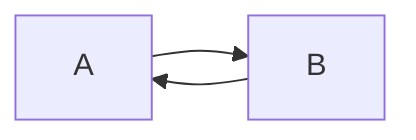

# Adding Items

In Pretzel, the workflow is as follows:

1. You define ``items`` which holds different properties (e.g. name, chemical formula, warnings etc.).

2. You control your ``stock``, using the defined ``items``.

3. You generate ``reports`` based on ``items`` (and ``stock``).

See the diagram below to visually see the structure of this.

!!! note "Note"
    If at *any* stage you're confused about anything, don't hesitate to contact me.

